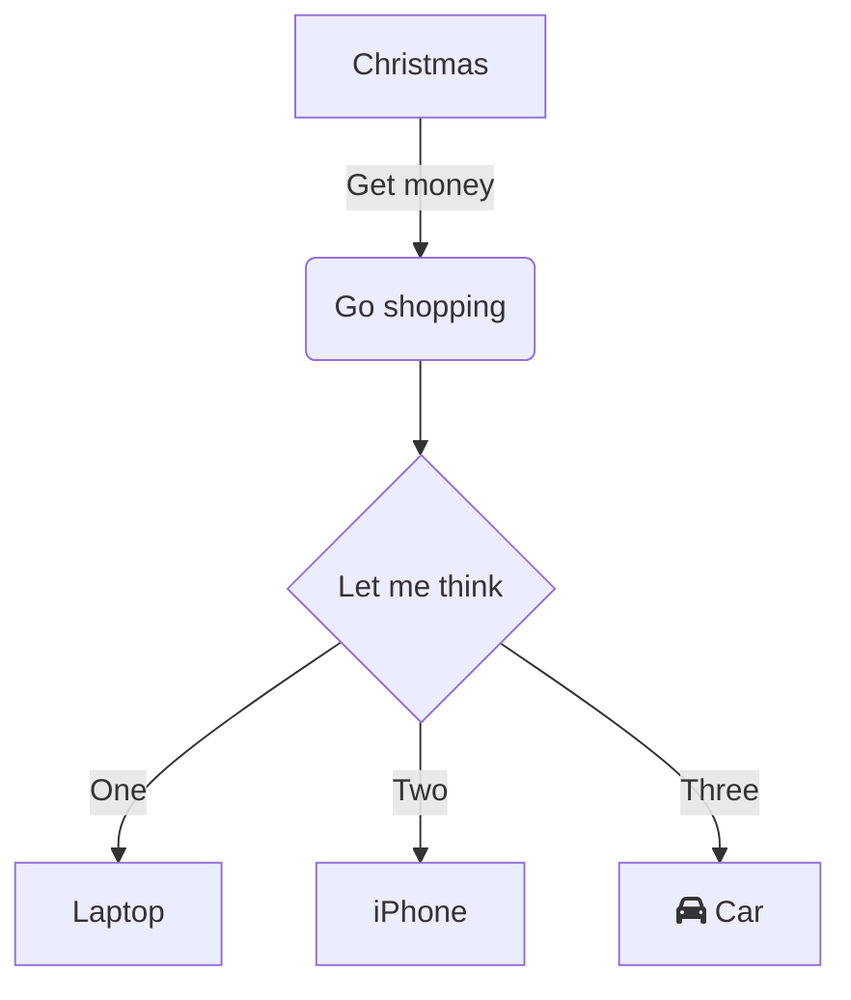

# Knowledge Base

Repository to group interesting links, blogs and readings I stumble upon.
   - blogs_rss_feeds.opml contains a list of interesting blogs to follow
   - My 2016 GDC presentation about the rendering tech powering rainbow six
   

